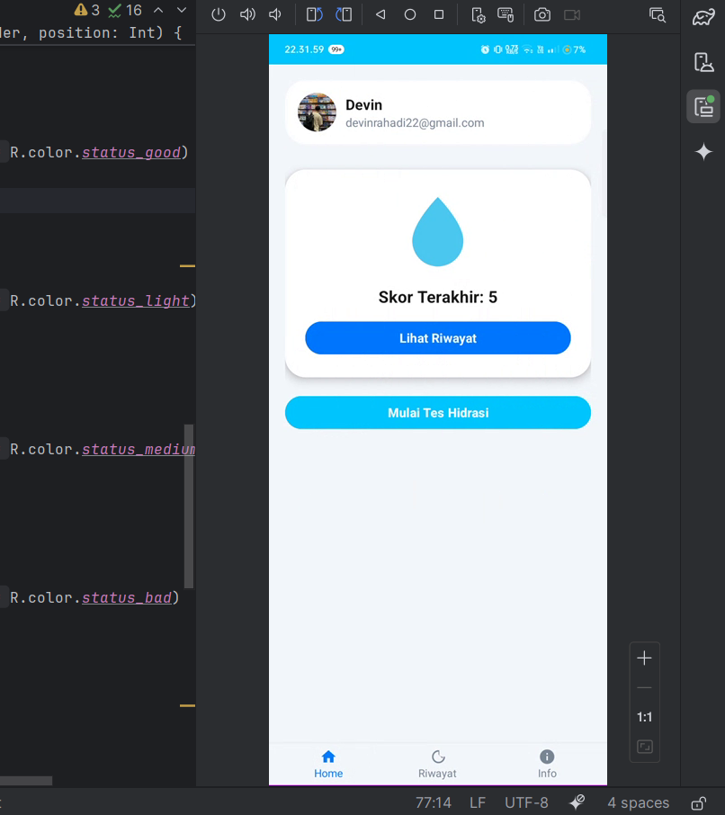
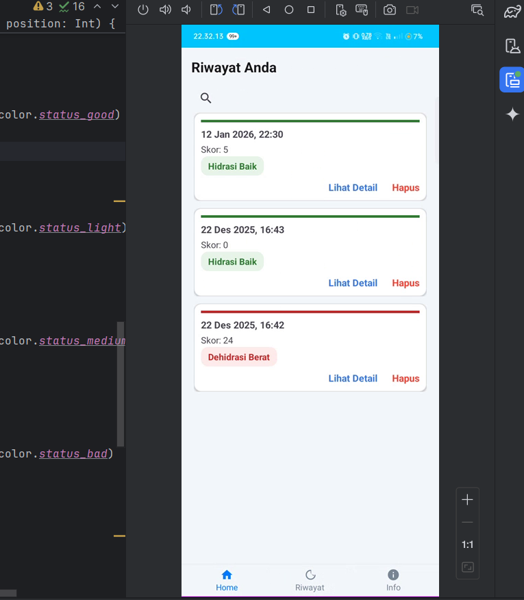
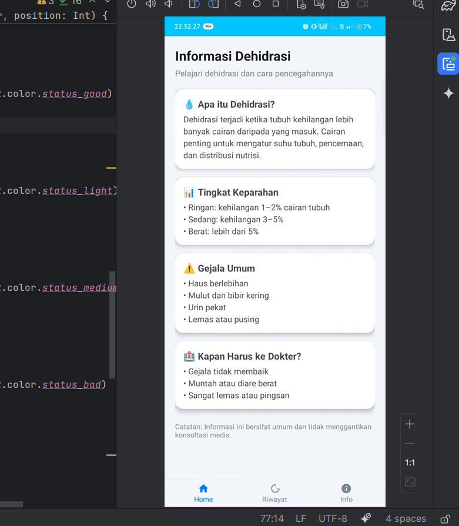
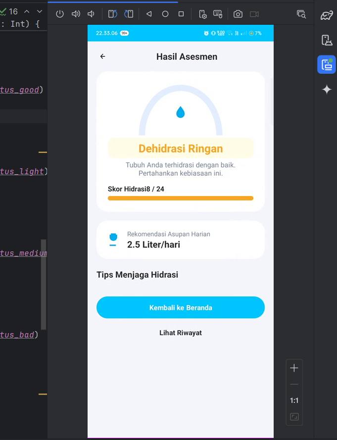

# 202513430037-T6
Repo Grup 6
# 💧 HydraCheck – Aplikasi Asesmen Hidrasi

<p align="center">
  
  
  
  
</p>

<p align="center">
  <a href="https://www.youtube.com/watch?v=YOUR_VIDEO_ID" target="_blank">
    
  </a>
</p>

> **HydraCheck** adalah aplikasi Android yang membantu pengguna melakukan **asesmen hidrasi tubuh**, menyimpan **riwayat hasil**, serta menyediakan **edukasi mengenai dehidrasi**. Aplikasi ini dikembangkan sebagai **proyek kelompok (Repo Grup 6)**.

---

## 📱 Preview Aplikasi

> 📌 *Tambahkan screenshot aplikasi ke folder `docs/` agar README terlihat lebih menarik.*

| Beranda            | Riwayat               | Informasi          | Hasil Asesmen        |
| ------------------ | --------------------- | ------------------ | -------------------- |
|  |  |  |  |

---

## ✨ Fitur Utama

* 🏠 **Beranda**

  * Menampilkan profil pengguna
  * Skor hidrasi terakhir
  * Tombol mulai tes hidrasi

* 📊 **Tes & Hasil Asesmen**

  * Perhitungan skor hidrasi
  * Kategori hasil:

    * Hidrasi Baik
    * Dehidrasi Ringan
    * Dehidrasi Berat
  * Rekomendasi asupan air harian

* 🕒 **Riwayat Asesmen**

  * Menyimpan hasil tes sebelumnya
  * Pencarian data
  * Lihat detail & hapus riwayat

* ℹ️ **Informasi Dehidrasi**

  * Penjelasan dehidrasi
  * Tingkat keparahan
  * Gejala umum
  * Kapan harus ke dokter

---

## 🛠️ Tech Stack

* **Platform**: Android
* **Bahasa**: Kotlin
* **UI**: Jetpack Compose
* **Database Lokal**: Room
* **Design System**: Material Design

---

## 📂 Struktur Repository

```
202513430037-T6/
├── HydraCheckFINAL.zip
├── .gitignore
├── README.md
└── docs/
    ├── home.png
    ├── history.png
    ├── info.png
    └── result.png
```

---

## 🚀 Cara Menjalankan Aplikasi

1. Download atau clone repository ini
2. Ekstrak `HydraCheckFINAL.zip`
3. Buka project menggunakan **Android Studio**
4. Tunggu proses **Gradle Sync** selesai
5. Jalankan aplikasi di emulator atau perangkat Android

---

## 🎯 Tujuan Pengembangan

* Meningkatkan kesadaran akan pentingnya hidrasi tubuh
* Memberikan simulasi aplikasi monitoring kesehatan
* Memenuhi tugas proyek kelompok

---

## ⚠️ Disclaimer

Aplikasi ini **bukan alat medis**. Informasi dan hasil asesmen bersifat edukatif dan tidak menggantikan konsultasi dengan tenaga medis profesional.

---

## 👥 Tim Pengembang (Repo Grup 6)

* Devin
* Anggota Kelompok lainnya

---

## ⭐ Dukungan

Jika repository ini bermanfaat, silakan beri ⭐ sebagai bentuk dukungan.

---

> *HydraCheck — Cek hidrasi hari ini, jaga kesehatan esok hari 💧*
